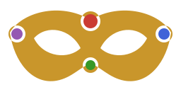
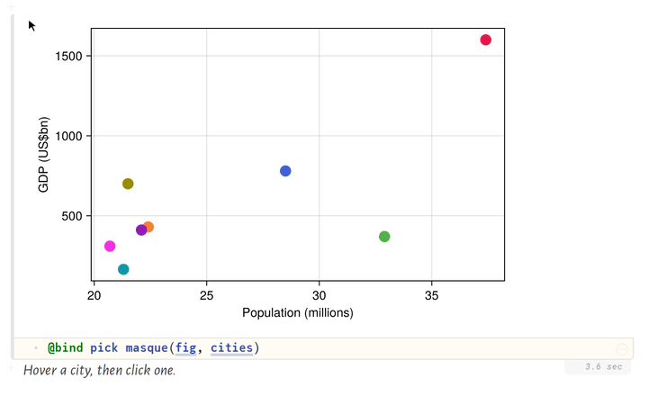

<p align="center">
  
</p>

<h1 align="center">Masque.jl</h1>

<p align="center"><b>Light, server-free interactivity for Makie plots in Pluto.</b></p>

<p align="center">
  <a href="https://github.com/jowch/Masque.jl/actions/workflows/CI.yml"></a>
  <a href="https://codecov.io/gh/jowch/Masque.jl"></a>
  <a href="https://jowch.github.io/Masque.jl/stable"></a>
  <a href="https://jowch.github.io/Masque.jl/dev"></a>
</p>

<p align="center">
  
</p>

Masque adds a thin JavaScript overlay to a Makie figure in a Pluto notebook. Hover shows
a tooltip, click selects, and the click reaches Julia through `@bind`. The figure itself is
rendered by CairoMakie or WGLMakie as usual.

- Points, lines, heatmap cells, bars, polygons, and text, on 2D, polar, and 3D axes.
- Drag gestures: region of interest, threshold line, pan.
- Hover and select still work in a static HTML export of the notebook.

## Backends

Loading `CairoMakie` or `WGLMakie` activates the matching extension. The `masque` call and
the `@bind` value are the same on both.

- **CairoMakie** renders the figure once to a static image and the overlay hit-tests on top.
  No WebGL and no server; a Julia process is needed only when a click should recompute
  something. Every re-render rasterises the whole figure, so it is a poor fit for animation.
- **WGLMakie** (`:webgl`, experimental) renders the figure live on the browser GPU. Use it
  for animation, large or live-updating data, or 3D you want to rotate. The page is heavier
  and needs WebGL.

See [Backends](https://jowch.github.io/Masque.jl/stable/backends/) for the cost model.

## Install

```julia
julia> ] add Masque
```

You'll also want `Pluto`, plus one Makie backend: `CairoMakie` for a static image, or
`WGLMakie` for animation / large data / live 3D.

## Quick start

In a Pluto notebook:

```julia
begin
    using Masque, CairoMakie

    # your figure, as usual
    fig = Figure()
    ax = Axis(fig[1, 1])
    pts = [(1.0, 1.0), (2.0, 4.0), (3.0, 9.0)]
    scatter!(ax, first.(pts), last.(pts))
end
```

```julia
# declare what's interactable, bind the result
@bind sel masque(fig, [PointInteractable(ax, pts; payloads = ["a", "b", "c"])])
```

```julia
# react to clicks — `sel` is `nothing` until a click, then an InteractionEvent
sel === nothing ? "click a point" : "you picked $(sel.payload)"
```

(Each fenced block above is its own Pluto cell — Pluto allows one top-level expression per
cell, so multi-statement setup goes in `begin ... end`.)

For more information, refer to our [documentation](https://jowch.github.io/Masque.jl). See [`examples/`](examples/) for several runnable Pluto notebooks.
